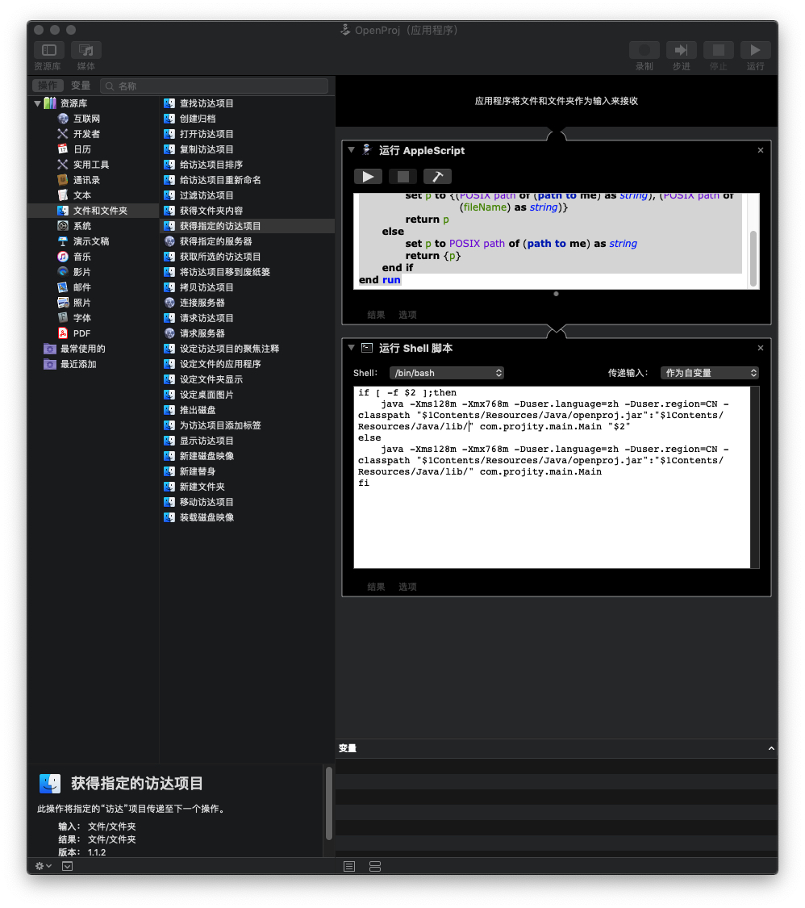
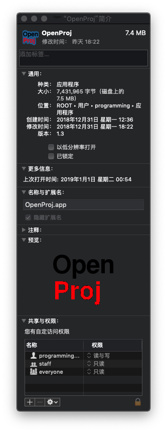

# repackOpenProj
===============

[OpenProj](https://sourceforge.net/projects/openproj/)是一个微软 Project 的开源替代方案，经过我自己的试用对比后，发现还是这个软件最符合我的需求。但是该项目最后维护的时间都在十年前了，没法很好的运行在现代的 Mac 上，于是我简单封装了一下。封装后才发现该项目作者重新搞了一个一样的软件，叫做[projectlibre](https://www.projectlibre.com/products)，下载下来试了一下，都可以直接打开OpenProj保存的文件，操作界面什么的也如出一辙。所以现在大家可以下载新版本了，不用像我这样费劲去封装。

不过我还是要把我封装的过程和结果记录下来并分享出来，毕竟我们会写很多自己的脚本软件，如果能通过这种方式变成应用保存和分发，也是很方便的。

以下原文发布在我的博客：[怎么把脚本变为 Mac 的 App](http://blog.shrp.me/How-To-Convert-Shell-Script-Into-Mac-App.html)

有时候我们需要把一些有意义的脚本变成程序，发布出来；或者对一些已有的程序增加一点定制，比如我下载的这款 OpenProj，好用是好用，但是默认的 app 已经不能直接打开，编辑 plist 什么的也不太好用。还好 Mac 操作系统这些操作都很简单。

首先我们找到原来这个程序应该怎么去执行的。通过分析原来的 App 目录下的 Info.plist 文件，我发现原来的程序是通过```java -Xms128m -Xmx768m -classpath ./Resources/Java/openproj.jar:./Resources/Java/lib/  com.projity.main.Main```命令来执行的。这不就是简单的 Java 命令嘛！打开 Mac 自带的 Automator，选择新建应用程序，在工作区中添加运行 shell 脚本，把上述命令粘贴进去不就行了嘛。可是点击右上角的运行，哎，不行啊，原来命令的目录是.，也就是相对路径，现在用 automator 工具执行是不行的。导出为 app 以后呢？试了一下，结果仍然不行。在 shell 命令里加一些调试的输出后发现，执行过程中相对路径是用户的 home，不是当前 app 的目录，也没有参数指向 app 的目录，这可真麻烦了。当然我们可以简单假设用户一定不会修改我 App 的名称，也一定会放到/Applications目录下，这样我们写成绝对路径是可以执行的。不过这样是合理的方案吗？当然不是了。怎么办呢？

还好难不倒我，通过在 shell 脚本前执行一段 AppleScript 脚本来获取当前应用的位置不就好了嘛！这段脚本如下：

~~~
on run {input, parameters}
		set p to POSIX path of (path to me)
		return {p}
end run
~~~

然后再下边 shell 脚本的右上方选择“传递输入：作为自变量”，于是现在程序执行的地址就被当做第一个参数被传进来了。同样更新一下 shell 脚本来使用这段路径：

~~~
java -Xms128m -Xmx768m -classpath "$1Contents/Resources/Java/openproj.jar":"$1Contents/Resources/Java/lib/" com.projity.main.Main
~~~

执行一下，嗯，不错！不过……为啥界面是英文的？刚刚我从命令行启动的好像是中文的呀？不用想，肯定是 app 里的 shell肯定是有定制化的成分，并没有直接获取系统的语言。还好这对 Java 程序来说非常简单，增加启动参数```-Duser.language=zh -Duser.region=CN```就行了嘛。

再试了一下，嗯，这回都对了！不过……能不能直接打开保存的文件，而不用每次都打开程序后在菜单里选择打开啊？太麻烦了！

嘛，这个倒也不是不能做，只是有些麻烦。首先是启动时的 AppleScript 要接收被打开的文件参数，然后传给 shell 脚本，然后 shell 脚本将其附加在最后作为程序的第一个参数给到 Java 就可以了。
修改如下:

AppleScript:

~~~
on run {input, parameters}
	set inputCount to count of input
	if inputCount is greater than or equal to 1 then
		set fileName to item 1 of input
		set p to {(POSIX path of (path to me) as string), (POSIX path of (fileName) as string)}
		return p
	else
		set p to POSIX path of (path to me) as string
		return {p}
	end if
end run
~~~

通过判断输入参数的个数来决定给 shell 的参数有几个。这里只选取第一个打开的文件作为参数传递给 Java。

shell：

~~~
if [ -f $2 ];then 
	java -Xms128m -Xmx768m -Duser.language=zh -Duser.region=CN -classpath "$1Contents/Resources/Java/openproj.jar":"$1Contents/Resources/Java/lib/" com.projity.main.Main "$2"
else 
	java -Xms128m -Xmx768m -Duser.language=zh -Duser.region=CN -classpath "$1Contents/Resources/Java/openproj.jar":"$1Contents/Resources/Java/lib/" com.projity.main.Main
fi
~~~

操作界面镇楼！



这样再一保存，完美~通过系统选择以后打开的程序，果然能够直接打开了。

不过……这个程序的图标也太丑了吧？还好 Mac 可以这么简单的修改图标：在应用点击右键，显示简介，先去找个合适的 icns 文件，复制，然后选择简介左上角的图标，然后粘贴，图标就被替换啦！



有了这个方法，你自己的 shell 程序或者 Java 程序也能非常简单的变成 Mac 的 App 了。我自己的项目已经放到 [GitHub - stirp/repackOpenProj: OpenProj是一个微软 Project 的开源替代方案，但是最后的维护时间已经是十年前了。在最新的 Mac 操作系统上没法直接使用，于是我重新封装为一个 App，需要系统拥有 java 命令。](https://github.com/stirp/repackOpenProj)，欢迎 follow。

PS：如果你要按照我的文章去操作，请注意我没有把程序的本体，也就是上文中出现的 Java 目录及 icns 文件放上来，大家可以自行到[OpenProj - Project Management download \| SourceForge.net](https://sourceforge.net/projects/openproj/)下载。
